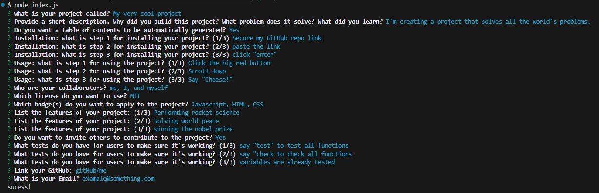

# My Project
 
## Description

Description

## 📁 Table of Contents
- [Installation](#installation)
- [Usage](#usage)
- [Features](#features)
- [Contributing](#contributing)
- [License](#license)

## Installation

```shell
# Clone Repository
git clone https://github.com/Dan-Swarts/README_Generator.git

```

```shell
# Download Dependencies
npm init

```

## Usage

```shell
# Run the program
node index.js
```

- Fill out the prompts, and recieve an auto-generated readme



```shell 
# Find your README.md file in the examples folder
cd example
ls
```

## Features

- Automatically formats the installation guide


- Automatically adds badges


## Questions
If you have any questions about My Project, contact me at danstraws@gmail.com. 

Check out my other projects at https://github.com/Dan-Swarts.

## Contributing

> [!IMPORTANT]
> Whether you have feedback on features, have encountered any bugs, or have suggestions for enhancements, we're eager to hear from you. Your insights help us make the My Project library more robust and user-friendly.

Please feel free to contribute by [submitting an issue](https://github.com) or [joining the discussions](https://github.com). Each contribution helps us grow and improve.

We appreciate your support and look forward to making our product even better with your help!

If you created an application or package and would like other developers to contribute it, you can include guidelines for how to do so. The [Contributor Covenant](https://www.contributor-covenant.org/) is an industry standard, but you can always write your own if you'd prefer.

## License
```
MIT License

Copyright (c) [year] [fullname]

Permission is hereby granted, free of charge, to any person obtaining a copy
of this software and associated documentation files (the "Software"), to deal
in the Software without restriction, including without limitation the rights
to use, copy, modify, merge, publish, distribute, sublicense, and/or sell
copies of the Software, and to permit persons to whom the Software is
furnished to do so, subject to the following conditions:

The above copyright notice and this permission notice shall be included in all
copies or substantial portions of the Software.

THE SOFTWARE IS PROVIDED "AS IS", WITHOUT WARRANTY OF ANY KIND, EXPRESS OR
IMPLIED, INCLUDING BUT NOT LIMITED TO THE WARRANTIES OF MERCHANTABILITY,
FITNESS FOR A PARTICULAR PURPOSE AND NONINFRINGEMENT. IN NO EVENT SHALL THE
AUTHORS OR COPYRIGHT HOLDERS BE LIABLE FOR ANY CLAIM, DAMAGES OR OTHER
LIABILITY, WHETHER IN AN ACTION OF CONTRACT, TORT OR OTHERWISE, ARISING FROM,
OUT OF OR IN CONNECTION WITH THE SOFTWARE OR THE USE OR OTHER DEALINGS IN THE
SOFTWARE.
```